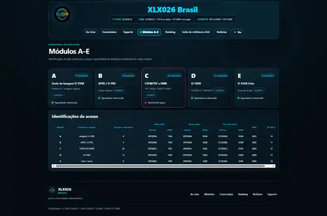

# 🌐 XLX Modern Installer — Instale, Configure e Recupere um Refletor XLX no Debian 12

<div align="center">


**Instalador e kit de manutenção para refletores XLX em Debian 12, com pré-validação, backup, dashboard moderno, diretório persistente de indicativos, certificados verificáveis, internacionalização, diagnóstico e recuperação.**

D-STAR • DMR • C4FM/YSF • XLX Echo • Dashboard moderno • Indicativos • Certificados • Debian 12

🇧🇷 **Português** | 🇺🇸 [English](README.en.md) | 📚 [Documentação](docs/README.md)

[Instalação](#-instalação-rápida) • [Como funciona](#-como-funciona-a-instalação) • [Painel](#-dashboard-moderno) • [Indicativos](#-diretório-persistente-de-indicativos) • [Certificados](#-certificados-de-participação) • [Backup](#-backup-diagnóstico-e-recuperação)

</div>

---

## 🖥️ Dashboard real — screenshots

As imagens abaixo são capturas reais do **XLX026 Brasil** usando o XLX Modern Dashboard.

### Ao vivo, transmissões, MTR, clima e propagação

<p align="center">
  
</p>

### Módulos A–E e identificações de acesso

<p align="center">
  
</p>

> As capturas são exemplos de uma instalação real. O instalador oficial é **universal**: nome, domínio, país, indicativo do responsável, YSF ID, TG DMR e demais dados são definidos por quem instala. Uma nova instalação não herda automaticamente a identidade do XLX026.

---

## 📖 O que é o XLX Modern Installer?

O **XLX Modern Installer** foi criado para facilitar a instalação, configuração, manutenção e recuperação de um **refletor XLX multiprotocolo** em Debian 12 x86_64.

O projeto usa como base técnica revisada o instalador de **Daniel K. — PP5PK** e acrescenta uma camada própria de segurança operacional, dashboard moderno, internacionalização, gerenciamento de indicativos, certificados de participação e documentação de recuperação.

O objetivo é permitir que uma VPS nova seja configurada com a identidade do refletor desejado — por exemplo `XLX724`, `XLX999` ou outro código XLX válido — sem depender de textos ou caminhos fixos do XLX026.

> **Princípio operacional:** diagnosticar antes de alterar, criar backup antes de mudanças, validar depois e manter rollback disponível.

---

## ✨ Recursos principais

| Recurso | Situação | Descrição |
|---|:---:|---|
| 🆕 Nova instalação XLX + painel | ✅ | Instala o núcleo XLX e depois o dashboard moderno |
| 🔎 Pré-validação / dry-run | ✅ | Valida Debian, arquitetura, recursos, rede e instalação existente |
| 🖥️ Instalação somente do painel | ✅ | Instala/reinstala o dashboard sem reinstalar o núcleo XLXD |
| 📡 Ao Vivo | ✅ | Monitor de transmissões com atualização rápida |
| 🕐 Histórico 24 h | ✅ | Exibe atividade das últimas 24 horas, com até 40 indicativos |
| 👥 Conectados | ✅ | Exibe estações conectadas, protocolo, módulo, localização e atividade |
| 🧩 Módulos A–E | ✅ | Visualização dos módulos e identificações de acesso |
| 🏆 Ranking | ✅ | Ranking de atividade baseado nos dados do servidor |
| 🌍 Painel em 6 idiomas | ✅ | `pt-BR`, `en`, `es`, `fr`, `de`, `it` |
| 👤 Diretório de indicativos | ✅ | Correções locais persistentes sem alterar a base principal |
| 🔁 Alias de indicativo | ✅ | Relaciona indicativo antigo com indicativo novo para resolução administrativa |
| 🧪 Integridade SQLite | ✅ | `PRAGMA integrity_check`, backup e rollback na atualização da base |
| 🏅 Certificados | ✅ | Emissão por atividade registrada, QR Code local e validação HMAC |
| 🎯 Campanhas automáticas | ✅ | Campanhas globais e campanhas condicionadas ao país configurado |
| 💾 Backup preventivo | ✅ | Protege arquivos antes de alterações reais |
| 🧾 Logs de instalação | ✅ | Mantém registro da execução para diagnóstico |
| 🛡️ Proteção de produção | ✅ | Bloqueia instalação completa sobre XLXD ativo |
| 🔊 XLX Echo | ✅ | Suporte ao serviço opcional quando instalado |
| 🔐 CI / auditoria pública | ✅ | Valida Bash, PHP, JavaScript, idiomas, instalação genérica, indicativos e certificados |
| 🧰 Reinstalação automática somente do núcleo | 🚧 | Ainda exige fluxo de recuperação dedicado; `install.sh` não sobrescreve produção ativa |

---

# 🚀 Instalação rápida

Use uma VPS/servidor limpo com **Debian 12 x86_64**.

### 1. Instale Git

```bash
sudo apt update
sudo apt install -y git
```

### 2. Clone o projeto

```bash
cd /usr/src
sudo git clone https://github.com/PU2PNY/XLX-Modern-Installer.git
cd XLX-Modern-Installer
```

### 3. Faça a pré-validação

```bash
sudo bash install.sh --check
```

O modo `--check` verifica o ambiente sem executar a instalação real.

### 4. Instale

```bash
sudo bash install.sh
```

O instalador cria backup preventivo e exige confirmação antes da alteração real.

### Instalar com idioma pré-definido

```bash
sudo bash install.sh --lang=en
```

Idiomas disponíveis:

```text
pt-BR  en  es  fr  de  it
```

---

# ⚙️ Como funciona a instalação

Em uma instalação completa, o fluxo principal é:

```text
PRÉ-VALIDAÇÃO
    ↓
BACKUP PREVENTIVO
    ↓
INSTALAÇÃO DO NÚCLEO XLXD
    ↓
DASHBOARD MODERNO
    ↓
PÓS-INSTALAÇÃO DO DASHBOARD
    ↓
DIRETÓRIO PERSISTENTE DE INDICATIVOS
    ↓
SISTEMA DE CERTIFICADOS
    ↓
VALIDAÇÕES FINAIS
```

O módulo `modules/60-dashboard-modern.sh` instala o dashboard e, na sequência, prepara os recursos integrados de indicativos e certificados.

Durante a configuração do painel são usados dados como:

- identificador do refletor, por exemplo `XLX724`;
- título/nome exibido;
- descrição;
- indicativo do responsável;
- cidade/região;
- país;
- domínio;
- e-mail de contato;
- YSF ID;
- TG DMR;
- idioma;
- timezone;
- aniversário opcional do refletor para campanhas de certificados.

A identidade configurada é reutilizada pelo painel e pelos certificados. Isso evita hardcodes como `BR-XLX...`, `XLX026 Brasil` ou domínio fixo em novas instalações.

---

# 🧭 O que você quer fazer?

| Objetivo | Comando / documentação |
|---|---|
| Verificar se o servidor está pronto | `sudo bash install.sh --check` |
| Nova instalação completa | `sudo bash install.sh` |
| Nova instalação com dashboard em inglês | `sudo bash install.sh --lang=en` |
| Instalar/reinstalar somente o dashboard | `sudo bash modules/60-dashboard-modern.sh` |
| Instalar dashboard em espanhol | `sudo bash modules/60-dashboard-modern.sh --lang=es` |
| Escolher diretório vazio do painel | `sudo bash modules/60-dashboard-modern.sh --dashboard-dir=/var/www/xlx-dashboard` |
| Consultar indicativo | `sudo xlx-user-directory lookup INDICATIVO` |
| Corrigir nome/localização | `sudo xlx-user-directory set INDICATIVO "Nome" "Cidade, Estado"` |
| Criar alias antigo → novo | `sudo xlx-user-directory alias ANTIGO NOVO` |
| Verificar bases SQLite | `sudo xlx-user-directory check` |
| Atualizar base principal com backup/rollback | `sudo xlx-user-directory refresh` |
| Usar certificados | Abra `/certificado.php` no domínio do refletor |
| Entender indicativos e certificados | [Guia completo](docs/INDICATIVOS-CERTIFICADOS.pt-BR.md) |
| Diagnosticar/recuperar XLX | [Guia de atualização e recuperação](docs/ATUALIZAR-RECUPERAR-XLX.pt-BR.md) |
| Conferir firewall e portas | [Firewall e portas do XLX](docs/FIREWALL-PORTAS-XLX.pt-BR.md) |
| Localizar arquivos e logs | [Arquivos e logs do XLX](docs/ARQUIVOS-LOGS-XLX.pt-BR.md) |
| HTTPS, YSF e pós-instalação | [Guia pós-instalação](docs/POS-INSTALACAO-XLX.pt-BR.md) |
| Entender idiomas | [Internacionalização](docs/INTERNATIONALIZATION.md) |

---

# 🖥️ Dashboard moderno

Se o XLXD já funciona e você deseja instalar ou reinstalar **somente o painel**:

```bash
cd /usr/src/XLX-Modern-Installer
sudo bash modules/60-dashboard-modern.sh
```

O módulo do dashboard também instala/verifica o diretório de indicativos e o sistema de certificados.

## Áreas principais

### Ao Vivo

- monitor de transmissões;
- estado do servidor;
- dados de TX;
- histórico das últimas 24 horas;
- até 40 indicativos distintos no histórico principal.

### Conectados

Mostra estações conectadas com dados disponíveis de indicativo, nome, localização, protocolo, módulo, tempo conectado e última atividade.

### Módulos A–E

Mostra função, protocolo, identificação e acessos configurados por módulo.

### Ranking

Resume atividade registrada no servidor conforme as fontes disponíveis.

## 🌍 Idiomas do dashboard

```text
1) Português (Brasil)
2) English
3) Español
4) Français
5) Deutsch
6) Italiano
```

Exemplo:

```bash
sudo bash modules/60-dashboard-modern.sh --lang=fr
```

A tradução é aplicada à cópia instalada, incluindo conteúdo visível e metadados relevantes. O build genérico é testado automaticamente pelo CI.

---

# 👤 Diretório persistente de indicativos

## Para que serve

A base principal de usuários continua em:

```text
/xlxd/users_db/users.db
```

As correções locais ficam separadas em:

```text
/var/lib/xlx-user-directory/overrides.db
```

Essa arquitetura evita que uma atualização/reconstrução da base principal apague correções locais.

## Consultar

```bash
sudo xlx-user-directory lookup PU2PNY
```

## Corrigir nome e localização

```bash
sudo xlx-user-directory set PU2PNY "Nome do operador" "Cidade, Estado"
```

## Indicativo antigo → novo

```bash
sudo xlx-user-directory alias PU2OLD PU2NEW
```

> O alias **não altera o indicativo que o rádio transmite**. Se o rádio/hotspot ainda estiver programado com o indicativo antigo, ele precisa ser corrigido no equipamento.

## Remover correção

```bash
sudo xlx-user-directory delete PU2PNY
```

## Verificar integridade

```bash
sudo xlx-user-directory check
```

## Atualizar a base principal

```bash
sudo xlx-user-directory refresh
```

O `refresh` faz backup da base atual, valida o backup, executa o gerador do XLX, valida a nova base com `PRAGMA integrity_check` e restaura a anterior se houver falha.

Backups:

```text
/var/backups/xlx-reflector/callsign-directory/
```

Guia detalhado: **[Indicativos, base de usuários e certificados](docs/INDICATIVOS-CERTIFICADOS.pt-BR.md)**.

---

# 🏅 Certificados de participação

## Para que serve

O sistema emite certificado para radioamador com **transmissão realmente registrada** no período da campanha ativa. Apenas existir na base de usuários não libera certificado.

Página:

```text
https://SEU-DOMINIO/certificado.php
```

## Como usar

1. Abra `certificado.php`.
2. Digite o indicativo.
3. O sistema procura atividade elegível.
4. Se encontrar, mostra a prévia.
5. Clique em **Emitir certificado**.
6. A emissão recebe um ID único e QR Code.
7. O usuário pode imprimir ou salvar em PDF pelo navegador.

## Emissão única

A combinação é única por:

```text
campanha + indicativo
```

Nova tentativa recupera o certificado já emitido.

## Validação

O QR Code aponta para:

```text
/certificado-validar.php?id=...&sig=...
```

A assinatura usa uma chave HMAC local:

```text
/etc/xlx-certificates/hmac.key
```

Registros de emissões:

```text
/var/lib/xlx-certificates/emissoes.jsonl
```

QR Codes são gerados localmente com `qrencode`, sem depender de gerador externo.

## Campanhas

Para qualquer país:

- participação diária;
- Dia Mundial do Radioamador — 18 de abril;
- semana de aniversário do refletor, se configurada.

Somente quando o país configurado é Brasil:

- Dia das Mães;
- Dia dos Pais;
- Independência do Brasil;
- Dia do Radioamador Brasileiro.

Assim, um refletor configurado como `XLX724` em Portugal não recebe campanhas brasileiras automaticamente.

Guia completo: **[Indicativos, base de usuários e certificados](docs/INDICATIVOS-CERTIFICADOS.pt-BR.md)**.

---

# 🔥 Firewall e portas

Não existe uma lista universal de portas que todo refletor precise abrir. Utilize apenas os protocolos e serviços realmente habilitados.

Confira o servidor:

```bash
sudo ss -lntup
sudo ufw status verbose
```

Tabela detalhada: **[Firewall e portas do XLX](docs/FIREWALL-PORTAS-XLX.pt-BR.md)**.

---

# 📂 Arquivos e dados importantes

```text
/xlxd/
/xlxd/users_db/users.db
/xlxd/callinghome.php
/xlxd/xlxd.whitelist
/xlxd/xlxd.blacklist
/xlxd/xlxd.interlink
/xlxd/xlxd.terminal
/etc/systemd/system/xlxd.service
/etc/systemd/system/xlxecho.service
/etc/apache2/
/var/www/html/xlx-dashboard/
/usr/src/XLX-Modern-Installer/
/var/lib/xlx-user-directory/overrides.db
/var/backups/xlx-reflector/callsign-directory/
/var/lib/xlx-certificates/emissoes.jsonl
/etc/xlx-certificates/hmac.key
/var/backups/xlx-reflector/
/var/log/xlx-reflector/installer/
```

> `users.db`, `overrides.db`, `emissoes.jsonl` e `hmac.key` são dados operacionais/privados e não devem ser publicados no repositório.

---

# 🔄 Atualização

Para atualizar somente o repositório local:

```bash
cd /usr/src/XLX-Modern-Installer
git status
git pull --ff-only
sudo bash install.sh --check
```

> **Não execute `install.sh` por cima de um XLXD em produção apenas porque o Git foi atualizado.** A instalação completa bloqueia sobrescrita de produção ativa.

Para atualizar/reinstalar apenas o dashboard e os recursos integrados:

```bash
sudo bash modules/60-dashboard-modern.sh
```

---

# 💾 Backup, diagnóstico e recuperação

Além dos arquivos tradicionais do XLX, uma recuperação completa deve preservar:

```text
/var/lib/xlx-user-directory/
/var/lib/xlx-certificates/
/etc/xlx-certificates/
```

A chave `/etc/xlx-certificates/hmac.key` é especialmente importante: certificados antigos dependem dela para continuar validando após uma recuperação do servidor.

Fluxo recomendado:

```text
DIAGNÓSTICO → INVENTÁRIO → BACKUP VERIFICADO → ALTERAÇÃO MÍNIMA → VALIDAÇÃO → ROLLBACK
```

Comandos úteis:

```bash
sudo systemctl status xlxd.service --no-pager
sudo journalctl -u xlxd.service -n 100 --no-pager
sudo apache2ctl configtest
sudo ss -lntup
sudo xlx-user-directory check
```

Guia: **[Atualizar, diagnosticar e recuperar XLX](docs/ATUALIZAR-RECUPERAR-XLX.pt-BR.md)**.

---

# 🎯 Pós-instalação e etapas adicionais

Dependendo da arquitetura:

- registro/publicação YSF — [DVRef](https://dvref.com/);
- HTTPS — [Certbot](https://certbot.eff.org/);
- teste de áudio / echo — [narspt/XLXEcho](https://github.com/narspt/XLXEcho);
- DNS, Apache e firewall;
- backup pós-instalação;
- documentação local dos protocolos e portas utilizados.

Veja **[Pós-instalação do XLX](docs/POS-INSTALACAO-XLX.pt-BR.md)**.

---

# 🧪 Qualidade e validação

O GitHub Actions verifica, entre outros pontos:

- sintaxe Bash;
- sintaxe PHP;
- sintaxe JavaScript;
- paridade dos seis catálogos de tradução;
- build genérico do dashboard em seis idiomas;
- ausência de branding fixo `BR-XLX999` / `XLX999 Brasil` no cenário genérico de teste;
- diretório persistente de indicativos;
- alias e integridade SQLite;
- instalação genérica dos certificados;
- wiring do fluxo de instalação;
- auditoria pública de segredos e publicação.

A automação complementa, mas não substitui, teste real em uma VPS de homologação antes de mudanças críticas em produção.

---

# 🧱 Estrutura do projeto

```text
XLX-Modern-Installer/
├── install.sh
├── README.md
├── README.en.md
├── LICENSE
├── SECURITY.md
├── CONTRIBUTING.md
├── THIRD_PARTY_NOTICES.md
├── dashboard/
│   ├── api/
│   ├── assets/
│   ├── config/
│   ├── i18n/
│   └── install/
├── extras/
│   └── certificados/
├── modules/
│   ├── 60-dashboard-modern.sh
│   ├── 65-callsign-directory.sh
│   └── 66-certificates.sh
├── tools/
│   └── xlx-user-directory.sh
├── docs/
├── scripts/
├── references/
├── tests/
└── .github/workflows/
```

---

# 🔐 Segurança

Nunca publique:

- senhas ou tokens;
- chaves privadas;
- `/etc/xlx-certificates/hmac.key`;
- bancos reais `users.db` ou `overrides.db`;
- `emissoes.jsonl` real;
- backups de produção;
- logs que exponham dados sensíveis.

Veja [SECURITY.md](SECURITY.md).

---

# ❓ Perguntas frequentes

### Se eu instalar outro refletor, o painel usa os dados dele?

Sim. Nome, título, domínio, país, responsável, YSF ID, TG DMR e demais dados configurados são aplicados à instalação. O template público é genérico.

### O sistema de certificado também usa os dados do novo refletor?

Sim. O certificado usa a identidade do `config/site.php` da instalação atual e campanhas condicionadas ao país configurado.

### A correção de indicativo muda o que o rádio transmite?

Não. Alias e overrides corrigem a resolução administrativa de dados. O indicativo programado no rádio/hotspot precisa ser atualizado no equipamento.

### As correções locais se perdem ao atualizar a base principal?

Não. Elas ficam em `overrides.db`, separadas de `users.db`.

### Posso instalar somente o dashboard?

Sim:

```bash
sudo bash modules/60-dashboard-modern.sh
```

Esse fluxo também instala/verifica indicativos e certificados.

### Como proteger certificados já emitidos em uma reinstalação completa?

Faça backup privado de:

```text
/var/lib/xlx-certificates/
/etc/xlx-certificates/
```

Sem a chave HMAC original, certificados antigos podem deixar de validar.

### Onde está o guia completo dos novos recursos?

**[docs/INDICATIVOS-CERTIFICADOS.pt-BR.md](docs/INDICATIVOS-CERTIFICADOS.pt-BR.md)**

---

# 🔗 Créditos e projetos relacionados

| Projeto / recurso | Relação com este projeto |
|---|---|
| [LX3JL/xlxd](https://github.com/LX3JL/xlxd) | Núcleo/refletor XLXD e referência upstream de protocolos |
| [PP5PK/XLX_Installer](https://github.com/PP5PK/XLX_Installer) | Base técnica revisada utilizada pelo instalador controlado |
| [narspt/XLXEcho](https://github.com/narspt/XLXEcho) | Serviço relacionado para echo/parrot |
| [Certbot](https://certbot.eff.org/) | Referência oficial para certificados HTTPS |
| [DVRef](https://dvref.com/) | Diretório/serviço relacionado a publicação de refletores compatíveis |
| **Dario — PU2PNY** | Manutenção desta versão, documentação, camada de segurança e dashboard moderno |

Consulte [THIRD_PARTY_NOTICES.md](THIRD_PARTY_NOTICES.md).

---

# 📄 Licença

As partes originais deste repositório são disponibilizadas sob **MIT License**. Componentes de terceiros permanecem sujeitos às respectivas licenças.

Leia [LICENSE](LICENSE) e [THIRD_PARTY_NOTICES.md](THIRD_PARTY_NOTICES.md).

---

<div align="center">

**XLX Modern Installer — instalação universal, dashboard moderno, indicativos persistentes e certificados verificáveis para a comunidade radioamadora.**

🇺🇸 [Read the English version](README.en.md)

</div>
